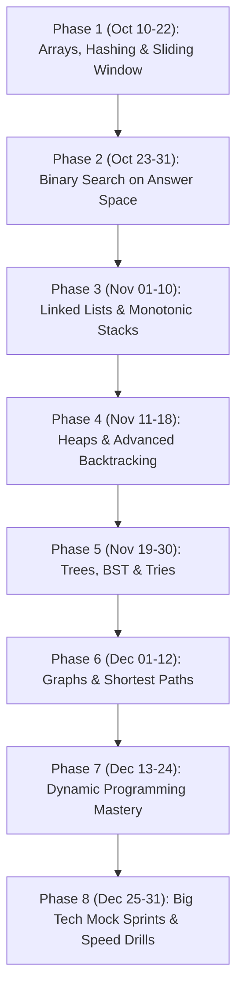

# 🚀 FAANG / Big Tech DSA Master Roadmap (Target: Dec 31, 2026)

> **Timeline:** October 10, 2026 ➔ December 31, 2026 (83 Total Days)  
> **Daily Time Budget:** 4.5 – 5.0 Hours/Day (~370 – 415 Practice Hours)  
> **Primary Language:** JavaScript (Node.js / ES6+)  
> **Target Bar:** Google, Meta, Amazon, Microsoft, Uber, Atlassian (L4/SDE-1 & SDE-2)

---

## 📊 Current State Audit (As of Oct 9, 2026)

| Module | Status | Notes |
| :--- | :---: | :--- |
| **Math & Number Theory** | ✅ Solid | Digit extraction, Armstrong, Palindromes, GCD, Divisors, Primes completed. |
| **Bitwise Operations** | ✅ Solid | Kernighan, ith bit, count bits, power of 2, reverse bits completed. |
| **Recursion & Backtracking** | 🟡 In Progress | Subsets, Permutations, Factorial done. Needs advanced pruning + tree recursion. |
| **Arrays & Hashing** | 🔴 High Priority | Foundation of 50%+ interview questions. Needs immediate deep-dive. |
| **Binary Search** | 🔴 Pending | Must master lower/upper bounds & Binary Search on Answer Space. |
| **Two Pointers & Sliding Window** | 🔴 Pending | Critical for Meta & Amazon string/array rounds. |
| **Linked Lists & Stacks/Queues** | 🔴 Pending | LRU Cache, Monotonic Stack & Deque are top tier interview classics. |
| **Trees & Tries** | 🔴 Pending | Bread & butter for Google and Microsoft. |
| **Graphs & Disjoint Set Union** | 🔴 Pending | Dijkstra, BFS/DFS, TopoSort, DSU frequently tested at Amazon/Google. |
| **Dynamic Programming** | 🔴 Pending | 1D, 2D Grid, Knapsack, LCS, LIS, Partition DP. |

---

## ⏰ The 4.5-Hour Daily Protocol (How Big Tech Candidates Train)

To crack Big Tech, mindless solving of 500 random problems fails. You need **Pattern Recognition + Timed Coding + Interview Articulation**.

```
┌────────────────────────────────────────────────────────────────────────┐
│ Block 1 (60 Min)  : Pattern Blueprint & Dry Run (Visual mental model)  │
│ Block 2 (150 Min) : 3-4 Targeted LeetCode Problems (1 Easy, 2 Med, 1 H)│
│ Block 3 (60 Min)  : Clean JavaScript Code, Edge Cases & Notes Writing  │
│ Block 4 (30 Min)  : Spaced Repetition (Re-solve 1 problem from 7d ago) │
└────────────────────────────────────────────────────────────────────────┘
```

### 🧠 The 25-Minute Rule during Practice
1. **First 5 mins:** Clarify constraints, identify input bounds ($N \le 10^5 \implies O(N \log N)$ or $O(N)$), brainstorm edge cases (empty, duplicates, negatives).
2. **Next 15 mins:** Dry run with pen/paper or comments. Do **not** look at solutions.
3. **If stuck after 25 mins:** Look at the *approach hint* only (not code). Code it yourself.
4. **Always analyze:** Time Complexity $O(T)$ and Space Complexity $O(S)$ in auxiliary memory.

---

## 🗺️ Master 83-Day Phased Schedule



---

### 🛡️ Phase 1: Core Arrays, Hashing, Two Pointers & Sliding Window
**Timeline:** October 10 – October 22 (13 Days | ~60 Hours)  
**Goal:** Master contiguous memory, frequency maps, two-pointer boundaries, and sliding windows.

- **Day 01 (Oct 10):** In-place Array Manipulation & Cyclic Shifts
  - *Problems:* LC 189 (Rotate Array), LC 283 (Move Zeroes), LC 26 (Remove Duplicates).
- **Day 02 (Oct 11):** Kadane's Algorithm & Prefix Sum
  - *Problems:* LC 53 (Maximum Subarray), LC 918 (Maximum Sum Circular Subarray), LC 303 (Range Sum Query).
- **Day 03 (Oct 12):** In-place Partitioning & Voting
  - *Problems:* LC 75 (Sort Colors - Dutch National Flag), LC 169 (Majority Element), LC 229 (Majority Element II).
- **Day 04 (Oct 13):** Permutations & Intervals Math
  - *Problems:* LC 31 (Next Permutation), LC 118 (Pascal's Triangle), LC 48 (Rotate Image).
- **Day 05 (Oct 14):** Advanced Hashing & Frequency Patterns
  - *Problems:* LC 1 (Two Sum), LC 49 (Group Anagrams), LC 128 (Longest Consecutive Sequence).
- **Day 06 (Oct 15):** Prefix Sum + Hash Map (The Gold Standard)
  - *Problems:* LC 560 (Subarray Sum Equals K), LC 525 (Contiguous Array), LC 974 (Subarray Sums Divisible by K).
- **Day 07 (Oct 16):** Interval Merging & Sweeping Line
  - *Problems:* LC 56 (Merge Intervals), LC 57 (Insert Interval), LC 435 (Non-overlapping Intervals).
- **Day 08 (Oct 17):** Opposite-Direction Two Pointers
  - *Problems:* LC 167 (Two Sum II), LC 15 (3Sum), LC 18 (4Sum).
- **Day 09 (Oct 18):** Trapping & Geometry Pointers
  - *Problems:* LC 11 (Container With Most Water), LC 42 (Trapping Rain Water - 2 Pointers approach).
- **Day 10 (Oct 19):** Fixed-Size Sliding Window
  - *Problems:* LC 643 (Maximum Average Subarray I), LC 438 (Find All Anagrams in a String), LC 567 (Permutation in String).
- **Day 11 (Oct 20):** Variable-Size Sliding Window (Expansion & Contraction)
  - *Problems:* LC 3 (Longest Substring Without Repeating Characters), LC 209 (Minimum Size Subarray Sum).
- **Day 12 (Oct 21):** Window Budget & Replacement
  - *Problems:* LC 1004 (Max Consecutive Ones III), LC 424 (Longest Repeating Character Replacement).
- **Day 13 (Oct 22) [Boss Challenge]:** Hard Window Problems
  - *Problems:* LC 76 (Minimum Window Substring), LC 30 (Substring with Concatenation of All Words).

---

### 🔍 Phase 2: Binary Search Mastery
**Timeline:** October 23 – October 31 (9 Days | ~42 Hours)  
**Goal:** Halve search spaces in $O(\log N)$ on arrays, 2D grids, and monotonic answer ranges.

- **Day 14 (Oct 23):** Standard Binary Search, Lower Bound & Upper Bound
  - *Problems:* LC 704 (Binary Search), LC 34 (First and Last Position of Element), LC 35 (Search Insert Position).
- **Day 15 (Oct 24):** Rotated Sorted Arrays
  - *Problems:* LC 33 (Search in Rotated Sorted Array), LC 81 (Rotated Array II with Duplicates), LC 153 (Find Min in Rotated Sorted Array).
- **Day 16 (Oct 25):** Peak Element & Single Non-Duplicate
  - *Problems:* LC 162 (Find Peak Element), LC 540 (Single Element in a Sorted Array).
- **Day 17 (Oct 26):** Binary Search on Answer Space (The Blueprint)
  - *Problems:* LC 69 (Sqrt x), LC 875 (Koko Eating Bananas).
- **Day 18 (Oct 27):** Allocation & Capacity Problems
  - *Problems:* LC 1011 (Capacity To Ship Packages Within D Days), LC 1283 (Find the Smallest Divisor Given a Threshold).
- **Day 19 (Oct 28):** Aggressive Cows & Distance Maximization
  - *Problems:* LC 1552 (Magnetic Force Between Two Balls), Painter's Partition Problem.
- **Day 20 (Oct 29):** 2D Matrix Binary Search
  - *Problems:* LC 74 (Search a 2D Matrix), LC 240 (Search a 2D Matrix II).
- **Day 21 (Oct 30):** Hard Matrix & Multi-Sorted Search
  - *Problems:* LC 378 (Kth Smallest Element in a Sorted Matrix), LC 410 (Split Array Largest Sum).
- **Day 22 (Oct 31) [Boss Challenge]:** Median of Two Sorted Arrays
  - *Problems:* LC 4 (Median of Two Sorted Arrays - $O(\log(\min(N, M)))$).

---

### 🧱 Phase 3: Linked Lists & Monotonic Stacks / Queues
**Timeline:** November 01 – November 10 (10 Days | ~45 Hours)  
**Goal:** Pointer re-wiring, $O(1)$ memory manipulation, and monotonic constraints.

- **Day 23 (Nov 01):** Pointer Reversals & Middle Element
  - *Problems:* LC 206 (Reverse Linked List), LC 876 (Middle of the Linked List), LC 92 (Reverse Linked List II).
- **Day 24 (Nov 02):** Fast & Slow Pointers (Floyd's Tortoise & Hare)
  - *Problems:* LC 141 (Linked List Cycle), LC 142 (Linked List Cycle II), LC 234 (Palindrome Linked List).
- **Day 25 (Nov 03):** List Merging & Complex Reordering
  - *Problems:* LC 21 (Merge Two Sorted Lists), LC 143 (Reorder List), LC 19 (Remove Nth Node From End).
- **Day 26 (Nov 04):** Node Copying & K-Group Reversal
  - *Problems:* LC 138 (Copy List with Random Pointer), LC 25 (Reverse Nodes in k-Group).
- **Day 27 (Nov 05):** Core Stacks & Min Stack
  - *Problems:* LC 20 (Valid Parentheses), LC 155 (Min Stack), LC 150 (Evaluate Reverse Polish Notation).
- **Day 28 (Nov 06):** Monotonic Stack Foundations
  - *Problems:* LC 496 (Next Greater Element I), LC 503 (Next Greater Element II), LC 739 (Daily Temperatures).
- **Day 29 (Nov 07):** Advanced Monotonic Stack
  - *Problems:* LC 84 (Largest Rectangle in Histogram), LC 85 (Maximal Rectangle), LC 907 (Sum of Subarray Minimums).
- **Day 30 (Nov 08):** Monotonic Queue / Deque
  - *Problems:* LC 239 (Sliding Window Maximum), LC 862 (Shortest Subarray with Sum at Least K).
- **Day 31 (Nov 09):** System Design Lite: LRU & LFU Cache
  - *Problems:* LC 146 (LRU Cache - Doubly LL + Hash Map), LC 460 (LFU Cache).
- **Day 32 (Nov 10) [Boss Challenge]:** Merge K Sorted Lists & Stream Queue
  - *Problems:* LC 23 (Merge k Sorted Lists), LC 622 (Design Circular Queue).

---

### 🌲 Phase 4: Heaps / Priority Queues & Advanced Backtracking
**Timeline:** November 11 – November 18 (8 Days | ~36 Hours)  
**Goal:** Master Heap invariants in JS and prune deep recursion trees.

- **Day 33 (Nov 11):** JS Heap Implementation & Fundamentals
  - *Skill:* Build a custom `MinHeap` and `MaxHeap` class in JS (essential for interviews).
  - *Problems:* LC 215 (Kth Largest Element in an Array), LC 973 (K Closest Points to Origin).
- **Day 34 (Nov 12):** Top K & Frequency Heaps
  - *Problems:* LC 347 (Top K Frequent Elements), LC 692 (Top K Frequent Words).
- **Day 35 (Nov 13):** Two Heaps Pattern
  - *Problems:* LC 295 (Find Median from Data Stream), LC 480 (Sliding Window Median).
- **Day 36 (Nov 14):** Interval Scheduling with Heaps
  - *Problems:* LC 253 (Meeting Rooms II), LC 621 (Task Scheduler).
- **Day 37 (Nov 15):** Backtracking Permutations & Combinations (Consolidation)
  - *Problems:* LC 39 (Combination Sum), LC 40 (Combination Sum II), LC 77 (Combinations).
- **Day 38 (Nov 16):** Partitioning & Grid Backtracking
  - *Problems:* LC 79 (Word Search), LC 131 (Palindrome Partitioning).
- **Day 39 (Nov 17):** Heavy Constraint Pruning
  - *Problems:* LC 51 (N-Queens), LC 37 (Sudoku Solver).
- **Day 40 (Nov 18) [Boss Challenge]:** Trie + Backtracking
  - *Problems:* LC 212 (Word Search II).

---

### 🌳 Phase 5: Trees, Binary Search Trees & Tries
**Timeline:** November 19 – November 30 (12 Days | ~54 Hours)  
**Goal:** Tree recursive invariants, tree views, serialization, and prefix trees.

- **Day 41 (Nov 19):** Tree Traversals (Iterative & Recursive)
  - *Problems:* LC 94 (Inorder), LC 144 (Preorder), LC 145 (Postorder), LC 102 (Level Order).
- **Day 42 (Nov 20):** Depth, Symmetry & Tree Inversion
  - *Problems:* LC 104 (Maximum Depth), LC 100 (Same Tree), LC 101 (Symmetric Tree), LC 226 (Invert Binary Tree).
- **Day 43 (Nov 21):** Tree Diameters & Subtree Returns
  - *Problems:* LC 543 (Diameter of Binary Tree), LC 110 (Balanced Binary Tree).
- **Day 44 (Nov 22):** Path Sums & Maximum Path
  - *Problems:* LC 112 (Path Sum), LC 113 (Path Sum II), LC 124 (Binary Tree Maximum Path Sum).
- **Day 45 (Nov 23):** Lowest Common Ancestor (LCA)
  - *Problems:* LC 236 (Lowest Common Ancestor of a Binary Tree), LC 235 (LCA of a BST).
- **Day 46 (Nov 24):** Tree Views & Boundary Traversal
  - *Problems:* LC 199 (Binary Tree Right Side View), Vertical Order Traversal (LC 987), Boundary Traversal.
- **Day 47 (Nov 25):** Tree Construction
  - *Problems:* LC 105 (Construct Binary Tree from Preorder and Inorder), LC 106 (Inorder and Postorder).
- **Day 48 (Nov 26):** Serialization & Flattening
  - *Problems:* LC 297 (Serialize and Deserialize Binary Tree), LC 114 (Flatten Binary Tree to Linked List).
- **Day 49 (Nov 27):** Binary Search Tree (BST) Properties
  - *Problems:* LC 98 (Validate BST), LC 230 (Kth Smallest Element in a BST), LC 700 (Search in BST).
- **Day 50 (Nov 28):** BST Modification & Successor
  - *Problems:* LC 450 (Delete Node in a BST), Inorder Successor in BST, LC 108 (Sorted Array to BST).
- **Day 51 (Nov 29):** Trie Foundations
  - *Problems:* LC 208 (Implement Trie Prefix Tree), LC 211 (Design Add and Search Words Data Structure).
- **Day 52 (Nov 30) [Boss Challenge]:** Bitwise Trie / Maximum XOR
  - *Problems:* LC 421 (Maximum XOR of Two Numbers in an Array).

---

### 🌐 Phase 6: Graph Algorithms & Disjoint Set Union
**Timeline:** December 01 – December 12 (12 Days | ~55 Hours)  
**Goal:** Vertices, edges, multi-source BFS, topological sorting, DSU, and shortest paths.

- **Day 53 (Dec 01):** Graph Representations & BFS/DFS Traversal
  - *Problems:* LC 200 (Number of Islands), LC 695 (Max Area of Island), LC 733 (Flood Fill).
- **Day 54 (Dec 02):** Cycle Detection & Bipartite Graphs
  - *Problems:* LC 785 (Is Graph Bipartite?), Cycle detection in Undirected Graph (BFS/DFS).
- **Day 55 (Dec 03):** Multi-Source BFS
  - *Problems:* LC 994 (Rotting Oranges), LC 542 (01 Matrix), LC 286 (Walls and Gates).
- **Day 56 (Dec 04):** Directed Cycle & Topological Sort (Kahn's BFS)
  - *Problems:* LC 207 (Course Schedule), LC 210 (Course Schedule II).
- **Day 57 (Dec 05):** Alien Dictionary & Advanced TopoSort
  - *Problems:* LC 269 (Alien Dictionary), LC 310 (Minimum Height Trees).
- **Day 58 (Dec 06):** Disjoint Set Union (DSU with Path Compression & Rank)
  - *Skill:* Write reusable `UnionFind` class.
  - *Problems:* LC 684 (Redundant Connection), LC 547 (Number of Provinces).
- **Day 59 (Dec 07):** DSU Applications & Minimum Spanning Tree
  - *Problems:* LC 1319 (Number of Operations to Make Network Connected), LC 1584 (Min Cost to Connect All Points - Kruskal's).
- **Day 60 (Dec 08):** Dijkstra's Algorithm (Single Source Shortest Path)
  - *Problems:* LC 743 (Network Delay Time), LC 787 (Cheapest Flights Within K Stops).
- **Day 61 (Dec 09):** Shortest Path in Grids / 0-1 BFS
  - *Problems:* LC 1091 (Shortest Path in Binary Matrix), LC 1631 (Path With Minimum Effort).
- **Day 62 (Dec 10):** Word Ladder & State Graphs
  - *Problems:* LC 127 (Word Ladder), LC 126 (Word Ladder II).
- **Day 63 (Dec 11):** Bellman-Ford & Negative Cycles
  - *Problems:* LC 787 (revisited via Bellman-Ford / DP), Floyd-Warshall mental model.
- **Day 64 (Dec 12) [Boss Challenge]:** Tarjan's / Bridges & Critical Connections
  - *Problems:* LC 1192 (Critical Connections in a Network).

---

### 🧙‍♂️ Phase 7: Dynamic Programming (DP)
**Timeline:** December 13 – December 24 (12 Days | ~55 Hours)  
**Goal:** Transition functions, state compression, memoization to tabulation.

- **Day 65 (Dec 13):** 1D DP & Space Optimization
  - *Problems:* LC 70 (Climbing Stairs), LC 198 (House Robber), LC 213 (House Robber II).
- **Day 66 (Dec 14):** 1D Jump & Decode
  - *Problems:* LC 55 (Jump Game), LC 45 (Jump Game II), LC 91 (Decode Ways).
- **Day 67 (Dec 15):** 2D Grid DP
  - *Problems:* LC 62 (Unique Paths), LC 63 (Unique Paths II), LC 64 (Minimum Path Sum).
- **Day 68 (Dec 16):** 0/1 Knapsack & Subset Sum
  - *Problems:* LC 416 (Partition Equal Subset Sum), LC 494 (Target Sum).
- **Day 69 (Dec 17):** Unbounded Knapsack & Coin Change
  - *Problems:* LC 322 (Coin Change), LC 518 (Coin Change II).
- **Day 70 (Dec 18):** Longest Common Subsequence (LCS) Pattern
  - *Problems:* LC 1143 (Longest Common Subsequence), LC 583 (Delete Operation for Two Strings).
- **Day 71 (Dec 19):** String Edit Distance
  - *Problems:* LC 72 (Edit Distance), LC 115 (Distinct Subsequences).
- **Day 72 (Dec 20):** Longest Increasing Subsequence (LIS)
  - *Problems:* LC 300 (Longest Increasing Subsequence - $O(N^2)$ DP & $O(N \log N)$ Binary Search / Patience Sorting), LC 354 (Russian Doll Envelopes).
- **Day 73 (Dec 21):** Best Time to Buy and Sell Stock Series
  - *Problems:* LC 121 (Stock I), LC 122 (Stock II), LC 123 (Stock III), LC 188 (Stock IV), LC 309 (Stock with Cooldown).
- **Day 74 (Dec 22):** Partition DP & Interval DP
  - *Problems:* LC 312 (Burst Balloons), Matrix Chain Multiplication.
- **Day 75 (Dec 23):** DP with Bitmask / State Compression
  - *Problems:* LC 847 (Shortest Path Visiting All Nodes).
- **Day 76 (Dec 24) [Boss Challenge]:** Regular Expression & Wildcard Matching
  - *Problems:* LC 10 (Regular Expression Matching), LC 44 (Wildcard Matching).

---

### 👑 Phase 8: Big Tech Mock Sprints & Interview Bar Simulation
**Timeline:** December 25 – December 31 (7 Days | ~35 Hours)  
**Goal:** Simulate real 45-minute live interviews, communication drills, edge case speed tests.

- **Day 77 (Dec 25): Google High-Frequency Drill**
  - LC 359 (Logger Rate Limiter), LC 388 (Longest Absolute File Path), LC 394 (Decode String), LC 843 (Guess the Word).
- **Day 78 (Dec 26): Meta Top 50 Drill**
  - LC 680 (Valid Palindrome II), LC 1249 (Minimum Remove to Make Valid Parentheses), LC 938 (Range Sum of BST), LC 314 (Binary Tree Vertical Order Traversal).
- **Day 79 (Dec 27): Amazon Top 50 Drill**
  - LC 146 (LRU Cache in 20 mins), LC 200 (Number of Islands in 15 mins), LC 994 (Rotting Oranges), LC 1268 (Search Suggestions System).
- **Day 80 (Dec 28): Timed Virtual Contests (LeetCode Biweekly/Weekly)**
  - Take 2 past LeetCode contests back-to-back under strict 90-min timer. Measure Q1-Q3 completion speed.
- **Day 81 (Dec 29): Behavioral + System Architecture Coding**
  - Concurrency in JS (Event Loop, Promises), Design In-Memory Key-Value Store with TTL, Amazon Leadership Principles stories.
- **Day 82 (Dec 30): Blind 75 / NeetCode 150 Flashcard Review**
  - Rapid-fire review of all 83 days' `Notes/` files. Mental trace of 50 Medium problems in 3 hours without writing full code.
- **Day 83 (Dec 31) [FINAL BOSS 🏆]: The Big Tech Gauntlet**
  - 3 mock interview simulations (1 Google style, 1 Meta style, 1 Amazon style).
  - Celebrate: Level 65 achieved! Ready for FAANG applications in Q1 2027!

---

## ⚡ JavaScript-Specific Rules for Big Tech Interviews

Big Tech interviewers will test your language fluency if you choose JavaScript:

1. **JavaScript Lacks Built-in Heaps / Priority Queues:**
   - On LeetCode, `@datastructures-js/priority-queue` is available globally (`MinPriorityQueue`, `MaxPriorityQueue`).
   - In live Google/Meta interviews on CoderPad, you must be able to write an 18-line binary `MinHeap` class from scratch or ask the interviewer if you can mock `heap.push()` and `heap.pop()`.
2. **Numbers & Bitwise Truncation:**
   - In JS, bitwise operations (`|`, `&`, `^`, `<<`, `>>`) implicitly cast numbers to **32-bit signed integers**.
   - Numbers above $2^{53} - 1$ lose precision (use `BigInt` if bounds exceed $10^{15}$).
3. **Array Matrix Initialization Pitfall:**
   - **Never do:** `new Array(m).fill(new Array(n).fill(0))` (shares array reference across all rows!).
   - **Always do:** `Array.from({ length: m }, () => new Array(n).fill(0))`.
4. **Recursion Stack Depth:**
   - V8 stack limit is typically ~10,000 frames. For deep graphs ($N = 10^5$), prefer iterative BFS/DFS or topological sorting.
5. **Hash Map Keys:**
   - Objects convert keys to strings (`{ [1,2]: true }` becomes `'1,2'`).
   - For coordinates `(r, c)`, use a string key `` `${r},${c}` `` or `(r * 100000 + c)` with `Set` or `Map`.

---

## 📈 Weekly Milestone Checkpoints

| Date | Milestone Target | Target Total Solved |
| :---: | :--- | :---: |
| **Oct 16** | End of Arrays & Sliding Window foundations | ~30 Problems |
| **Oct 24** | Binary Search on Answer Space Mastered | ~60 Problems |
| **Nov 02** | Linked Lists, LRU & Monotonic Stack Fluency | ~95 Problems |
| **Nov 10** | Custom Heaps & Backtracking Pruning Complete | ~125 Problems |
| **Nov 22** | Binary Trees, BST & Tries Mastered | ~165 Problems |
| **Dec 04** | BFS/DFS, TopoSort, DSU, Dijkstra Graphs Mastered | ~205 Problems |
| **Dec 16** | 1D & 2D Grid DP & Knapsack Conquered | ~245 Problems |
| **Dec 24** | String DP, LIS & Partition DP Complete | ~275 Problems |
| **Dec 31** | Blind 75 / NeetCode 150 + Big Tech Tagged Sprints | **~300+ Problems** |

---

*Keep this roadmap open, update your quest badges daily, and let's conquer the journey!*
