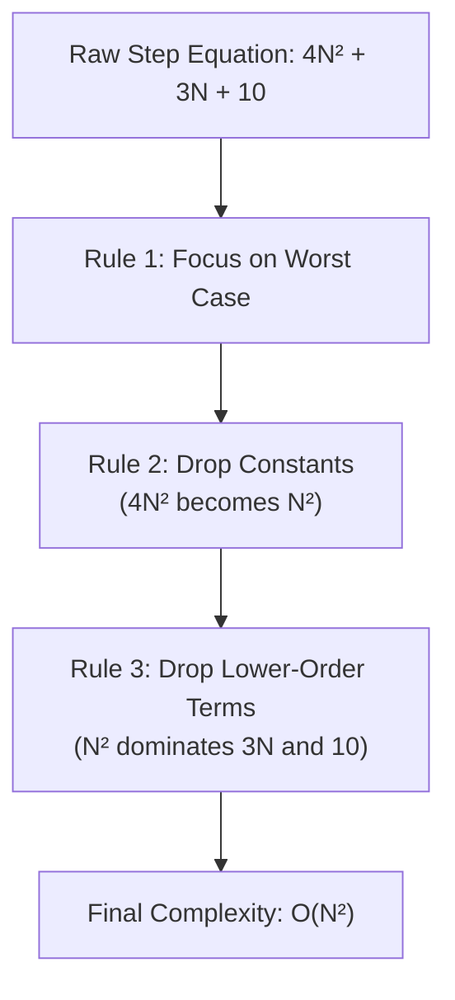
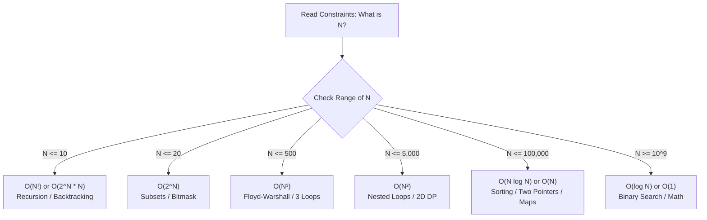

# Complete Guide to Time & Space Complexity
*Reference: Striver's A2Z DSA Course — Lecture 01 Notes*

---

## 1. Why Do We Need Complexity Analysis?

When writing code, beginners often measure efficiency using a stopwatch or execution timer (e.g., "my code runs in 0.05 seconds"). 

### Why measuring in seconds fails:
1. **Machine Specs:** An Intel i9 / Apple M3 processor runs significantly faster than an older Core i3 laptop.
2. **System Load:** If your laptop is running a game or compiling code in the background, your program runs slower.
3. **Language Difference:** C++ runs much faster than Python for the exact same logic.

```
       Machine A (Supercomputer)         Machine B (Budget Laptop)
            [ 0.002 sec ]                      [ 0.450 sec ]
                  \                                 /
                   \_______ Same Code Logic _______/
```

> **The Solution:** We count **how the number of basic operations grows as the input size ($N$) increases**, completely independent of the hardware or language.

---

## 2. Time Complexity Explained

### What is Time Complexity?
> **Time Complexity** is **not** the physical time taken by a machine to execute code.  
> It is a mathematical function that describes the **rate at which the execution time / number of steps grows** as the input size ($N$) scales.

```
Input Size (N) ───►  [ Algorithm Steps ]  ───►  Rate of Growth
```

---

## 3. Big-O ($\mathcal{O}$) Notation

In computer science, algorithms are analyzed in three cases:
- **Best Case ($\Omega$ - Omega):** Least number of steps (e.g., target found at the very first index).
- **Average Case ($\Theta$ - Theta):** Typical average performance across random inputs.
- **Worst Case ($\mathcal{O}$ - Big-O):** Maximum number of steps the algorithm could ever take.

> **In Interviews & Competitive Programming:**  
> We always focus on **Big-O (Worst-Case Upper Bound)**. It acts as a performance guarantee: *"No matter how bad the input data is, my code will never take more steps than this."*

---

## 4. The 3 Golden Rules of Calculating Big-O



### Rule 1: Always Consider the Worst Case
Consider **Linear Search** on an array of size $N$:
- **Best Case:** The element is at index `0` $\rightarrow$ 1 operation $\rightarrow \mathcal{O}(1)$.
- **Worst Case:** The element is at the very last index or doesn't exist $\rightarrow N$ operations.
- **Verdict:** We state the time complexity as **$\mathcal{O}(N)$**.

---

### Rule 2: Ignore Constant Multipliers & Additions
Constants do not alter the growth curve when $N$ becomes huge (like $N = 10^7$).

* $5N \longrightarrow \mathcal{O}(N)$
* $2N + 100 \longrightarrow \mathcal{O}(N)$
* $\frac{N}{2} \longrightarrow \mathcal{O}(N)$

#### Visual Example:
```javascript
// This loop runs 3 * N times:
for (let i = 0; i < N; i++) {
    console.log(a);
    console.log(b);
    console.log(c);
}
// Time Complexity is O(N), NOT O(3N).
```

---

### Rule 3: Drop Lower-Order Terms
When $N$ is massive, higher-order powers completely **dwarf** (make look tiny and insignificant) smaller powers.

> **Analogy — The Billionaire's Wallet 💰:**  
> If someone has **$10,000,000,000** (10 Billion) in their bank account, **$500,000** in a safe, and **$12** pocket change:  
> How rich are they? You say **"A 10-billionaire"**. The $12$ and $500,000$ don't matter at all when compared to 10 Billion!

#### The Math with $N = 100,000$:
$$\text{Steps} = N^2 + 5N + 12$$

| Term | At $N = 100,000$ | Share of Total Work | Importance |
| :--- | :--- | :--- | :--- |
| **$N^2$** | **$10,000,000,000$ (10 Billion)** | **$99.995\%$** | 🏔️ **Dominates everything (Keep this!)** |
| **$5N$** | $500,000$ (Half a Million) | $0.005\%$ | 🪨 Negligible (Drop it) |
| **$12$** | $12$ | $0.0000001\%$ | 🐜 Completely insignificant (Drop it) |

Therefore:
$$\mathcal{O}(N^2 + 5N + 12) \longrightarrow \mathbf{\mathcal{O}(N^2)}$$

---

## 5. Visualizing Common Time Complexities

### Growth Curve Hierarchy (Fastest to Slowest)
$$\mathcal{O}(1) < \mathcal{O}(\log N) < \mathcal{O}(\sqrt{N}) < \mathcal{O}(N) < \mathcal{O}(N \log N) < \mathcal{O}(N^2) < \mathcal{O}(N^3) < \mathcal{O}(2^N) < \mathcal{O}(N!)$$

```
Operations (Steps)
   ▲
   │                                                         
   │  │   |          |           /                                
   │  │   |          |          /       /                        
   │  │   |          |         /       /        /                
   │  │   |          |        /       /        /        /        
   │  │   |          |       /       /        /        /        .----
   │  │   |          |      /       /        /        /   .---'  
   │  │   |          |     /       /        /   .----'           
   │  │   |          |    /       /   .----'                     
   │  │   |          |   /  .----'                               
   │  │   |          |.-'                                        
   │  │   |       .-'                                            
   │  │   |    .-'                                               
   │  │   | .-'                                                  
   │  │.-'                                                       
   │  O(N!)  O(2^N)    O(N³)       O(N²)   O(N log N)   O(N)     O(√N)
   │  [Horrible]   [Terrible]     [Slow]     [Fair]    [Good]   [Great]
   │──────────────────────────────────────────────────────────── O(log N) [Excellent]
   │──────────────────────────────────────────────────────────── O(1)     [Ideal]
   └────────────────────────────────────────────────────────────► Input Size (N)
```

#### Speed Zones at a Glance:
* 🟢 **Excellent / Ideal:** $\mathcal{O}(1)$, $\mathcal{O}(\log N)$, $\mathcal{O}(\sqrt{N})$ — Lightning fast, handles billions of inputs.
* 🟡 **Good / Fair:** $\mathcal{O}(N)$, $\mathcal{O}(N \log N)$ — Standard for modern algorithms and efficient sorting (handles $10^6$ to $10^8$).
* 🟠 **Slow (Warning):** $\mathcal{O}(N^2)$, $\mathcal{O}(N^3)$ — Nested loops. Only works for smaller inputs ($N \le 5,000$).
* 🔴 **Terrible (Danger):** $\mathcal{O}(2^N)$, $\mathcal{O}(N!)$ — Exponential/Factorial. Freezes the computer for $N > 20$.

---

### Real Numbers Comparison Table (See how they explode! 💥)

| Complexity | $N = 10$ | $N = 100$ | $N = 1,000$ | $N = 100,000$ |
| :--- | :--- | :--- | :--- | :--- |
| **$\mathcal{O}(1)$** | 1 op | 1 op | 1 op | 1 op |
| **$\mathcal{O}(\log_2 N)$** | ~3 ops | ~7 ops | ~10 ops | ~17 ops |
| **$\mathcal{O}(\sqrt{N})$** | ~3 ops | 10 ops | ~31 ops | ~316 ops |
| **$\mathcal{O}(N)$** | 10 ops | 100 ops | 1,000 ops | 100,000 ops |
| **$\mathcal{O}(N \log_2 N)$**| ~33 ops | ~664 ops | ~9,965 ops | ~1,660,964 ops |
| **$\mathcal{O}(N^2)$** | 100 ops | 10,000 ops | 1,000,000 ops | **10,000,000,000 ops** ❌ |
| **$\mathcal{O}(N^3)$** | 1,000 ops | 1,000,000 ops | **1,000,000,000 ops** ❌ | Too huge to compute |
| **$\mathcal{O}(2^N)$** | 1,024 ops | **$1.26 \times 10^{30}$** 💥 | Crashes universe | Impossible |
| **$\mathcal{O}(N!)$** | **3.6 Million** | Universe explodes 💥 | Impossible | Impossible |

### Detailed Breakdown with JavaScript Examples

#### 1. $\mathcal{O}(1)$ — Constant Time
The number of operations never changes, regardless of the input array size.
```javascript
function getFirst(arr) {
    return arr[0]; // Exactly 1 step, whether arr has 5 or 5,000,000 items
}
```

---

#### 2. $\mathcal{O}(\log N)$ — Logarithmic Time
Every step cuts the remaining search space in half.
```javascript
// Example: Binary Search (Array must be sorted)
function binarySearch(arr, target) {
    let low = 0;
    let high = arr.length - 1;

    while (low <= high) {
        const mid = Math.floor(low + (high - low) / 2);

        if (arr[mid] === target) return mid;
        if (arr[mid] < target) {
            low = mid + 1;  // eliminate left half
        } else {
            high = mid - 1; // eliminate right half
        }
    }
    return -1;
}
```
* If $N = 16 \rightarrow 8 \rightarrow 4 \rightarrow 2 \rightarrow 1$ (only 4 steps!)
* If $N = 1,000,000,000 \rightarrow$ only $\approx 30$ steps!

---

#### 3. $\mathcal{O}(\sqrt{N})$ — Square Root Time
Common in prime number checking and number theory problems. Instead of looping up to $N$, we only loop up to $\sqrt{N}$.
```javascript
// Checking if a number N is Prime
function isPrime(n) {
    if (n <= 1) return false;
    for (let i = 2; i * i <= n; i++) { // runs up to Math.sqrt(n) times
        if (n % i === 0) return false;
    }
    return true;
}
```
* If $N = 100 \rightarrow$ runs only $10$ times.
* If $N = 10^8 \rightarrow$ runs only $10,000$ times! (Passes in milliseconds)

---

#### 4. $\mathcal{O}(N)$ — Linear Time
Steps grow directly proportional to the size of $N$.
```javascript
function calculateSum(arr) {
    let sum = 0;
    for (let i = 0; i < arr.length; i++) {
        sum += arr[i]; // runs N times
    }
    return sum;
}
```

---

#### 5. $\mathcal{O}(N \log N)$ — Linearithmic Time (Sorting Time)
Occurs when an algorithm performs an $\mathcal{O}(\log N)$ operation for every one of the $N$ elements, or when a problem of size $N$ is repeatedly split in half ($\log N$ levels) and at each level, all $N$ elements are processed.

```
Merge Sort Recursion Tree:
Level 0:  [────── N ──────]               Work = N
Level 1:  [── N/2 ──] [── N/2 ──]         Work = N/2 + N/2 = N
Level 2:  [N/4][N/4]  [N/4][N/4]          Work = N/4 * 4 = N
...
Depth:    log₂(N) levels                  Total Work = N × log₂(N)
```

```javascript
// 1. Built-in JS Sort (V8 engine uses Timsort: O(N log N))
const arr = [5, 2, 8, 1, 9];
arr.sort((a, b) => a - b); // O(N log N)

// 2. Loop of N containing a log(N) operation:
// e.g., N iterations, where each iteration does a Binary Search
for (let i = 0; i < arr.length; i++) {
    binarySearch(arr, targetValues[i]); // N * log(N) = O(N log N)
}
```

---

#### 6. $\mathcal{O}(N^2)$ — Quadratic Time
Typically represented by nested loops where both loops depend on $N$, comparing all pairs.
```javascript
// Example: Checking all pairs (e.g., Bubble Sort, brute-force Two Sum)
function findPair(arr, target) {
    for (let i = 0; i < arr.length; i++) {
        for (let j = i + 1; j < arr.length; j++) {
            if (arr[i] + arr[j] === target) {
                return [i, j];
            }
        }
    }
    return null;
}
```

---

#### 7. $\mathcal{O}(N^3)$ — Cubic Time
Three nested loops. Common in brute-force triplet searches or naive matrix multiplication.
```javascript
// Example: Finding all triplets (i, j, k) that sum to zero
function threeSumBruteForce(arr) {
    const triplets = [];
    const n = arr.length;
    for (let i = 0; i < n; i++) {
        for (let j = i + 1; j < n; j++) {
            for (let k = j + 1; k < n; k++) {
                if (arr[i] + arr[j] + arr[k] === 0) {
                    triplets.push([arr[i], arr[j], arr[k]]);
                }
            }
        }
    }
    return triplets;
}
```

---

#### 8. $\mathcal{O}(2^N)$ — Exponential Time
The number of operations doubles with every single addition to the input size. Typical of naive recursive algorithms without memoization (like generating all subsets or naive Fibonacci).

```
Recursive Tree for Fibonacci fib(4):
               fib(4)
             /        \
         fib(3)       fib(2)
        /      \      /     \
     fib(2)  fib(1) fib(1)  fib(0)
    /     \
  fib(1) fib(0)
```

```javascript
// Naive Recursive Fibonacci (No memoization)
function fib(n) {
    if (n <= 1) return n;
    return fib(n - 1) + fib(n - 2); // 2 recursive branches -> O(2^N)
}
```
* If $N = 30 \rightarrow 2^{30} \approx 10^9$ operations (already very sluggish!)

---

#### 9. $\mathcal{O}(N!)$ — Factorial Time
The slowest practical complexity. Occurs when generating all possible permutations of an array.
```javascript
// Generating all permutations of an array
function permute(arr) {
    const result = [];

    function backtrack(currentArr, remaining) {
        if (remaining.length === 0) {
            result.push(currentArr);
            return;
        }
        for (let i = 0; i < remaining.length; i++) {
            const nextRemaining = remaining.slice(0, i).concat(remaining.slice(i + 1));
            backtrack([...currentArr, remaining[i]], nextRemaining);
        }
    }

    backtrack([], arr);
    return result;
}
```
* If $N = 10 \rightarrow 10! = 3,628,800$ operations.
* If $N = 15 \rightarrow 15! \approx 1.3 \times 10^{12}$ operations (browser will freeze or crash).

---

## 6. Space Complexity Explained (Deep Dive for Beginners)

### 6.1 What is Space Complexity Really?
Just like Time Complexity doesn't measure seconds, **Space Complexity does NOT measure megabytes (MB) or gigabytes (GB)**. 

> **Space Complexity** measures:  
> **How much additional memory (RAM) your algorithm allocates as the input size ($N$) grows.**

---

### 6.2 The Mental Model: The Chef and the Kitchen Counter 🍳
Imagine you are a chef making a salad:
* **The Input Space:** The bowl of raw vegetables the customer handed you (size $N$). You didn't buy it; it was just given to you.
* **The Auxiliary Space:** The extra chopping boards, plates, or bowls you pull out from your own kitchen cupboard to do your work.

```
┌────────────────────────────────────────────────────────────────────────┐
│                        Total Space Complexity                          │
├───────────────────────────────────┬────────────────────────────────────┤
│           Input Space             │          Auxiliary Space           │
│                                   │                                    │
│  Memory required to hold the      │  Extra / temporary memory YOU      │
│  given inputs (not your fault).   │  allocate to solve the problem.    │
│  Example: an array of size N      │  Example: hash maps, temp arrays,  │
│           takes O(N).             │           call stack memory.       │
└───────────────────────────────────┴────────────────────────────────────┘
```

> **The Golden Formula:**  
> $$\text{Total Space Complexity} = \text{Input Space} + \text{Auxiliary Space}$$
>
> ⚠️ **In Coding Interviews:** When interviewers ask *"What is the space complexity?"*, they almost always mean **Auxiliary Space** (the extra space *your algorithm* created). Always clarify: *"Do you mean auxiliary space or total space?"*

---

### 6.3 Auxiliary Space Examples in JavaScript

#### Example A: $\mathcal{O}(1)$ Auxiliary Space (Constant Extra Space)
No matter how big the array gets, we only create a single counter variable.
```javascript
function findMax(arr) {
    let maxVal = -Infinity; // 1 extra variable: O(1) space

    for (let i = 0; i < arr.length; i++) {
        if (arr[i] > maxVal) {
            maxVal = arr[i];
        }
    }
    return maxVal;
}
// Input Space: O(N) (the array given to us)
// Auxiliary Space: O(1) (only 'maxVal' and 'i')
```

---

#### Example B: $\mathcal{O}(N)$ Auxiliary Space (Linear Extra Space)
If we create a new data structure that stores $N$ elements:
```javascript
function doubleArray(arr) {
    const doubled = []; // creates an entirely new array

    for (let i = 0; i < arr.length; i++) {
        doubled.push(arr[i] * 2); // stores N elements
    }
    return doubled;
}
// Input Space: O(N)
// Auxiliary Space: O(N) because the new 'doubled' array grows with N!
```

---

#### Example C: $\mathcal{O}(N)$ Space using a Hash Set / Map
Common in algorithms checking for duplicates or 2-Sum:
```javascript
function hasDuplicates(arr) {
    const seen = new Set(); // In the worst case, holds all N unique elements

    for (const num of arr) {
        if (seen.has(num)) return true;
        seen.add(num);
    }
    return false;
}
// Auxiliary Space: O(N) in the worst case (all elements unique)
```

---

### 6.4 The "Hidden" Space: The Recursion Call Stack 🥞

Many beginners think: *"I didn't create any array or Set, so my auxiliary space is $\mathcal{O}(1)$!"*  
**Watch out! Recursion consumes hidden memory on the Call Stack.**

Every time a function calls itself, the computer saves the function's state in a stack frame in RAM:

```
Recursion: countdown(3)
┌────────────────────────┐
│  countdown(1) frame    │  ▲
├────────────────────────┤  │ Call Stack grows to depth N!
│  countdown(2) frame    │  │
├────────────────────────┤  │
│  countdown(3) frame    │  ▼
└────────────────────────┘
```

```javascript
function countdown(n) {
    if (n === 0) return;
    countdown(n - 1); // pauses current frame, creates a new one
}
```
* **Even though no array is created**, the call stack grows $N$ levels deep!
* **Auxiliary Space = $\mathcal{O}(N)$** (Stack Space).

---

### 6.5 In-Place Modification vs Clean Engineering (Crucial Interview Topic)

What if an interviewer asks: *"Reverse this array in $\mathcal{O}(1)$ auxiliary space?"*

#### Approach 1: In-Place Mutation ($\mathcal{O}(1)$ Extra Space)
```javascript
function reverseInPlace(arr) {
    let left = 0, right = arr.length - 1;
    while (left < right) {
        [arr[left], arr[right]] = [arr[right], arr[left]]; // modifies original array!
        left++;
        right--;
    }
    return arr;
}
```

#### Approach 2: Creating a New Array ($\mathcal{O}(N)$ Extra Space)
```javascript
function reversePure(arr) {
    const copy = [];
    for (let i = arr.length - 1; i >= 0; i--) {
        copy.push(arr[i]); // leaves original array untouched
    }
    return copy;
}
```

#### Why does this matter in real-world software engineering?
```
      [Original User Data]
               │
      ┌────────┴────────────────────────┐
      ▼                                 ▼
Approach 1: In-Place Mutation      Approach 2: Extra Auxiliary Space
❌ RISKY IN PRODUCTION             ✅ SAFE & RELIABLE
• Destroys original data           • Keeps input data untouched (Pure Function)
• Bugs if other functions need it  • Safe in concurrent/async environments
• Hard to debug in large codebases • Standard industry best practice
```

> **Pro Interview Tip:**  
> When you see a chance to mutate input in-place, explain the trade-off to the interviewer:  
> *"I can solve this in $\mathcal{O}(1)$ auxiliary space by modifying the input array directly, but in a production environment, mutating input data can introduce bugs and side-effects. Would you prefer an in-place $\mathcal{O}(1)$ solution or a non-mutating $\mathcal{O}(N)$ approach?"*  
> (Interviewers **love** this — it shows you understand real software engineering!)

---

## 7. The Competitive Programmer's Secret: The $10^8$ Rule

In online platforms (LeetCode, Codeforces, HackerRank), problem time limits are almost universally **1.0 second**.

$$\mathbf{1 \text{ Second}} \approx \mathbf{10^8 \text{ Operations}}$$

### How to Pick the Correct Algorithm Using Constraints
Look at the constraint on $N$ in the problem description before writing a single line of code:



### Constraints Cheat Sheet

| Value of $N$ (Input Size) | Acceptable Time Complexity | Max Operations ($N$ substituted) | Will it Pass in 1.0 sec? |
| :--- | :--- | :--- | :--- |
| **$N \le 10$** | $\mathcal{O}(N!)$ | $10! \approx 3.6 \times 10^6$ |  Passes easily |
| **$N \le 20$** | $\mathcal{O}(2^N)$ | $2^{20} \approx 1.04 \times 10^6$ |  Passes easily |
| **$N \le 500$** | $\mathcal{O}(N^3)$ | $500^3 = 1.25 \times 10^8$ |  Borderline / Passes |
| **$N \le 5,000$** | $\mathcal{O}(N^2)$ | $(5 \times 10^3)^2 = 2.5 \times 10^7$ |  Passes |
| **$N \le 10^5$** | $\mathcal{O}(N^2)$ | $(10^5)^2 = 10^{10} \gg 10^8$ | ❌ **TLE (Time Limit Exceeded)** |
| **$N \le 10^5$** | $\mathcal{O}(N \log N)$ | $10^5 \times 17 \approx 1.7 \times 10^6$ |  Passes easily |
| **$N \le 10^8$** | $\mathcal{O}(N)$ | $10^8$ |  Borderline / Passes |
| **$N \ge 10^9$** | $\mathcal{O}(\log N)$ or $\mathcal{O}(1)$ | $\approx 30$ |  Passes instantly |

---

## 8. Summary Checklist for Interviews

1. **Mention Worst-Case First:** State Big-O ($\mathcal{O}$) clearly and confidently.
2. **Break Down Space:** Mention **Auxiliary Space** separately from the **Input Space**.
3. **Don't Forget the Call Stack:** In recursive solutions, include the recursive call stack space (depth of the recursion tree).
4. **Inspect Constraints Before Coding:** If $N = 10^5$, immediately reject any $\mathcal{O}(N^2)$ brute-force approach and aim for $\mathcal{O}(N \log N)$ or $\mathcal{O}(N)$.
